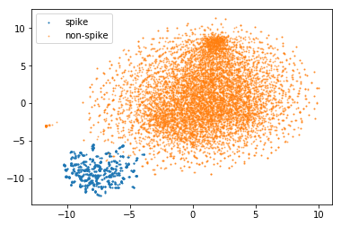
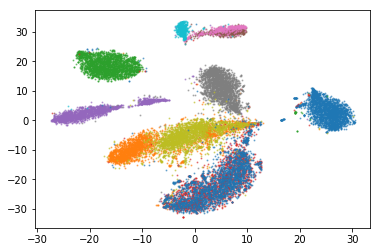

# LSHVec: Locality Sensitive Vector Representation of DNA Sequences

## Summary

LSHVec is a k-mer/sequence embedding/classfication software which extends [FastText](https://fasttext.cc/) . It applies LSH (Locality Sensitive Hashing) to reduce the size of k-mer vocabulary and improve the performance of embedding.

Besides building from source code, LSHVec can run using docker or singularity.

To cite LSHVec: 

## Requirements

Here is the environment I worked on.  Other versions may also work. Python 3 should work, but I don't use it a lot.

1. Linux, gcc with C++11
2. Python 2.7 or Python 3.6 or 3.7
   - joblib 0.12.4
   - tqdm 4.28.1
   - numpy 1.15.0
   - pandas 0.23.4
   - sklearn 0.19.1 (only for evaluation)
   - MulticoreTSNE (only for visualization)
   - cython 0.28.5
   - csparc (included)

## Build from Source

- clone from git

  `git clone https://LizhenShi@bitbucket.org/LizhenShi/lshvec.git`

  `cd lshvec`

- install csparc which wraps a c version of k-mer generator I used in another project

  for python 2.7

  `pip install pysparc-0.1-cp27-cp27mu-linux_x86_64.whl`

  or for python 3.6

  `pip install pysparc-0.1-cp36-cp36m-linux_x86_64.whl`

  or for python 3.7

  `pip install pysparc-0.1-cp37-cp37m-linux_x86_64.whl`

- make 

  `make`

## Jupyter Notebook Examples

A toy example, which is laptop friendly and should finish in 10 minutes,  can be found in [Tutorial_Toy_Example.ipynb](notebook/Tutorial_Toy_Example.ipynb). Because of randomness the result may be different.

A practical example which uses ActinoMock Nanopore data can be found at [Tutorial_ActinoMock_Nanopore.ipynb](notebook/Tutorial_ActinoMock_Nanopore.ipynb). The notebook ran on a 16-core 64G-mem node and took a few hours (I think 32G mem should work too).

​						 

## Command line options

### fastqToSeq.py

convert a fastq file to a seq file

    python fastqToSeq.py -i <fastq_file> -o <out seq file> -s <1 to shuffle, 0 otherwise>

###  hashSeq.py

Encode reads in a seq file use an encoding method.

    python hashSeq.py -i <seq_file> --hash <fnv or lsh> -o <outfile> [-k <kmer_size>] [--n_thread <n>] [--hash_size <m>] [--batch_size <n>] [--bucket <n>] [--lsh_file <file>] [--create_lsh_only]
    
      --hash_size <m>:        only used by lsh which defines 2^m bucket.
      --bucket <n>:           number of bucket for hash trick, useless for onehot.
       				          For fnv and lsh it limits the max number of words.
       				          For lsh the max number of words is min(2^m, n).
      --batch_size <b>:       how many reads are processed at a time. A small value uses less memory.

### lshvec

Please refer to [fasttext options](https://fasttext.cc/docs/en/options.html).  However note that options of `wordNgrams`, `minn`,`maxn` does not work with lshvec.

## Example of Docker Run 

Pull from docker hub:

    docker pull lizhen0909/lshvec:latest
    
Assume `data.fastq` file is in folder `/path/in/host`.

convert fastq to a seq file:

    docker run -v /path/in/host:/host lshvec:latest bash -c "cd /host && fastqToSeq.py  -i data.fastq -o data.seq"
    
create LSH:

    docker run -v /path/in/host:/host lshvec:latest bash -c "cd /host && hashSeq.py -i data.seq --hash lsh -o data.hash -k 15"

run lshvec:

    docker run -v /path/in/host:/host lshvec:latest bash -c "cd /host && lshvec skipgram -input data.hash -output model"

## Example of Singularity Run 

When running using Singularity, it is probably in an HPC environment. The running is similar to docker. However depending on the version of singularity, commands and paths might be different, especially from 2.x to 3.x. Here is an example for version 2.5.0. 

Also it is better to specify number of threads, otherwise max number of cores will be used which is not desired in HPC environment.

Pull from docker hub:

    singularity pull --name lshvec.sif shub://Lizhen0909/LSHVec
    
Put `data.fastq` file is in host `/tmp`,  since Singularity automatically mount `/tmp` folder.

convert fastq to a seq file:

    singularity run /path/to/lshvec.sif bash -c "cd /tmp && fastqToSeq.py  -i data.fastq -o data.seq"
    
create LSH:

    singularity run /path/to/lshvec.sif bash -c "cd /tmp && hashSeq.py -i data.seq --hash lsh -o data.hash -k 15 --n_thread 12"

run lshvec:

    singularity run /path/to/lshvec.sif bash -c "cd /tmp && lshvec skipgram -input data.hash -output model -thread 12"

## Questions

-  `lshvec` gets stuck at `Read xxxM words` 

  Search `MAX_VOCAB_SIZE` in the source code and change it to a bigger one.  When a word's index is bigger than that number, a loop is carried to query it, which is costly. The number is 30M in FastText which is good for languages. But it is too small for k-mers. The number has been already increased to 300M in FastSeq. But for large and/or high-error-rate data, it may be still not enough.

- I have big data 

  hashSeq reads all data into memory to sample k-mers for hyperplanes. If data is too big it may not fit into memory. One can 

  1. Try sampling. DNA reads generally have high coverage. Such high coverage may not be necessary. 
  2. Or use `create_hash_only` to create lsh on a small (sampled) data; then split your data into multiple files and run hashSeq with `lsh_file` option on many nodes.

## License

Inherit license from FastText which is BSD License

